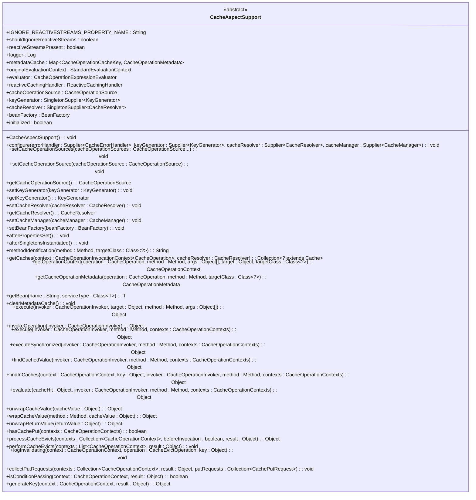

# Config

## Cache
1. interface that define the operations that a type of cache will behave
2. inner class `ValueWrapper`是cache統一回傳的包裝class
3. valueLoader在一個get method的variant中是一個Callable, 用在如果cache中不存在key時,會通過這個valueLoader來load value並存到cache中
4. valueLoader在另一個retrieve method的variant中是一個Supplier, 用在key沒有hit的時候,asynchronize去load value並存到cache中

## CacheManager
1. 會管理Cache

## AnnotationDrivenCacheBeanDefinitionParser
流程：
```
1. parse <cache:annotation-driven mode=?> tag
2. register所需的CacheAspect, CacheAdvisor, CacheInterceptor等
3. #parse是入口method, 方法中根據mode去使用AspectJ mode或是Proxy mode
4. 會將帶有@Cache相關annotation的bean加入到AspectJ/SpringAOP的Aspect中,後續在runtime的aspect中處理cache logic
5. AspectJ mode: compile, build time weaving
6. Spring AOP mode: run time weaving
```

## CacheAdviceParser
1. extends `AbstractSingleBeanDefinitionParser`, 是一種BeanDefinitionParser
2. #doParse會傳入一個`BeanDefinitionBuilder`,這個builder是`CacheInterceptor` bean的builder,並透過傳入的Element (xml element) 來設定該builder中的properties
3. 目的：parse <cache:advice> or <tx:advice>底下的<caching>相關xml tag,並把相關的內容透過builder設定好,之後就可以initiate一個與該xml對應的CacheInterceptor
4. design pattern: Builder pattern, override #doParse表示這個class是BeanDefinitionParser的strategy pattern的一部分

## CacheManagementConfigUtils
1. 提供cache相關bean的final String name, 用來避免hard coded和並讓subpackages使用

## CacheNamespaceHandler
1. 負責呼叫register AnnotationDrivenCacheBeanDefinitionParser和CacheAdviceParser
2. 這裡的namespace指的是xml中的namespace
3. process:
```
1. Initialize Spring context.
2. Locate and load `NamespaceHandler` using `NamespaceHandlerResolver`.
3. Call `init()` method of `CacheNamespaceHandler`.
4. Use registered `BeanDefinitionParser` to parse XML elements.
```

---

# Support

## AbstractCacheManager
1. implements `CacheManager`
2. implements `InitializingBean`, so that it can trigger the #initializeCache method once it is initialized
3. #getCache method support on-demand creating cache: 在getCache miss的創建, 如果不想lazy create, 可以呼叫lookupCache
4. #decorateCache method do not use the 'Decorator pattern'

## AbstractValueAdaptingCache
1. implements `Cache`
2. provide functionality for handling null value in cache
3. if `allowNullValues` is true, it will convert user null value to the internal null value: `NullValue.INSTANCE`
4. NullValue here is a **NullObjectPattern**, and the INSTANCE it returns adapts **Singleton Pattern** 

## NullValue
1. a **NullObjectPattern** object

## SimpleValueWrapper
1. implements Cache.ValueWrapper
2. 在ValueWrapper的基礎上增加從constructor傳入value, 和一個get method的implementation

## CompositeCacheManager
1. implements `CacheManager`
2. associated with many `CacheManager` instances
3. #getCache(String)會遍歷每個cacheManager去找有沒有對應的value,但有可能都沒有找到,會回傳null
4. 如果`fallingToNoOpCache` = true, 這個class會在最後添加一個NoOpCacheManager,這樣就不會出現null pointer exception (**NullObjectPattern**)

## NoOpCache
1. implement `Cache`
2. **NullObjectPattern**

## NoOpCacheManager
1. implement `CacheManager`
2. **NullObjectPattern**

## SimpleCacheManager
1. implement `AbstractCacheManager`
2. 多了#setCaches(), 可以跳過bean registration的步驟,在testing很好用

---

# Interceptor

## CacheOperation
1. implements `BasicOperation`
2. **Builder Pattern**
3. represents a cache operation

## CacheableOperation
1. extends `CacheOperation`
2. describe the cacheable operation
3. `unless`是除非...否則會cache
4. `sync`會讓這個operation變成只有一個thread可以執行
5. 標記在那些get method上

## CacheEvictOperation
1. extends `CacheOperation`
2. describe the cache evict operation
3. `cacheWide`: whether the eviction should apply to entire cache
4. `beforeInvokation`: whether the eviction should executed before the method is invoked
5. 標記在那些執行evict的method上

## CachePutOperation
1. extends `CacheOperation`
2. describe the cache put operation
3. `unless`

## AbstractCacheInvoker
1. abstract base class for invoking cache operation
2. 提供統一的error handling mechanism
3. invoke get, put, evict cache
```marmaid
classDiagram
    class AbstractCacheInvoker {
        - errorHandler: SingletonSupplier~CacheErrorHandler~
        + AbstractCacheInvoker()
        + AbstractCacheInvoker(errorHandler: CacheErrorHandler)
        + setErrorHandler(errorHandler: CacheErrorHandler): void
        + getErrorHandler(): CacheErrorHandler
        + doGet(cache: Cache, key: Object): Cache.ValueWrapper
        + doGet(cache: Cache, key: Object, valueLoader: Callable~T~): <T> T
        + doRetrieve(cache: Cache, key: Object): CompletableFuture~?~
        + doRetrieve(cache: Cache, key: Object, valueLoader: Supplier~CompletableFuture~T~~): <T> CompletableFuture~T~
        + doPut(cache: Cache, key: Object, value: Object): void
        + doEvict(cache: Cache, key: Object, immediate: boolean): void
        + doClear(cache: Cache, immediate: boolean): void
}
```

## CacheAspectSupport
1. extends `AbstractCacheInvoker`
2. implements `BeanFactoryAware`, `InitializingBean`, `SmartInitializingSingleton`
3. CacheInterceptor的base class (本身是一個Template method pattern的class)
4. Subclasses are responsible for calling relevant methods in the correct order
5. 讓spring cache infrastructure可以輕鬆實現任何aspect system
6. CacheOperationSource的作用是parse @Cacheable, @CahePut, @CacheEvict等operation並轉成具體的CacheOperation
7.
    `CacheOperationSource`: determining cache operations, this class use **Strategy Design Pattern** on this object
    `KeyGenerator`: build the cache keys
    `CacheResolver`: resolve the actual caches, 這個class透過CacheResolver來動態決定使用哪個Cache

8. 重要operation: #execute()
如果synchronized (@Cacheable.sync), 則判斷conditionIsPassing, 通過就取出cache值
否則其他method在非同步的作法上都是調用`ReactiveCachingHandler` inner class

9. 執行operation的時候如果沒有hit, 會透過#evaluate()去回到原本的 (非caching) 作法
10. Cache流程：
```
1. spring發現@Cacheable, @CachePut等annotation
2. 透過proxy factory來創建一個proxy用於攔截該method的調用
3. spring將CacheInterceptor配置為該proxy的Aspect
4. 當method被調用,CacheInterceptor會攔截到,並且透過CacheOperationSource取出CacheOperation, 透過CacheResolver取出cache,或是KeyGenerator來產生cache key
5. CacheInterceptor的execute被調用
```
11. Inner classes
    * CacheOperationMetadata: cache operation的metadata, 包含CacheOperation, targetClass, CacheResolver, KeyGenerator等
    * CacheOperationContext: 執行CacheOperation的上下文, target, 參數和caches, 也包含CacheOperationMetadata
    * CacheOperationContexts: 包裝多個CacheOperationContext
    * CacheOperationCacheKey: 用於存取CacheAspectSupport中metadataCache中的CacheOperationMetadata
    * CachePutRequest: 用於處理CachePut operation, 其中包含一個CacheOperationContext
    * CachePutListSubscriber: 用於處理 `Flux` 的cache put operation。它收集 `Flux` 的值並將其放入cache
    * ReactiveCachingHandler: 用於處理asynchronize cache operation。它避免了在runtime對 Reactive Streams API 的dependency

12. mermaid code  

